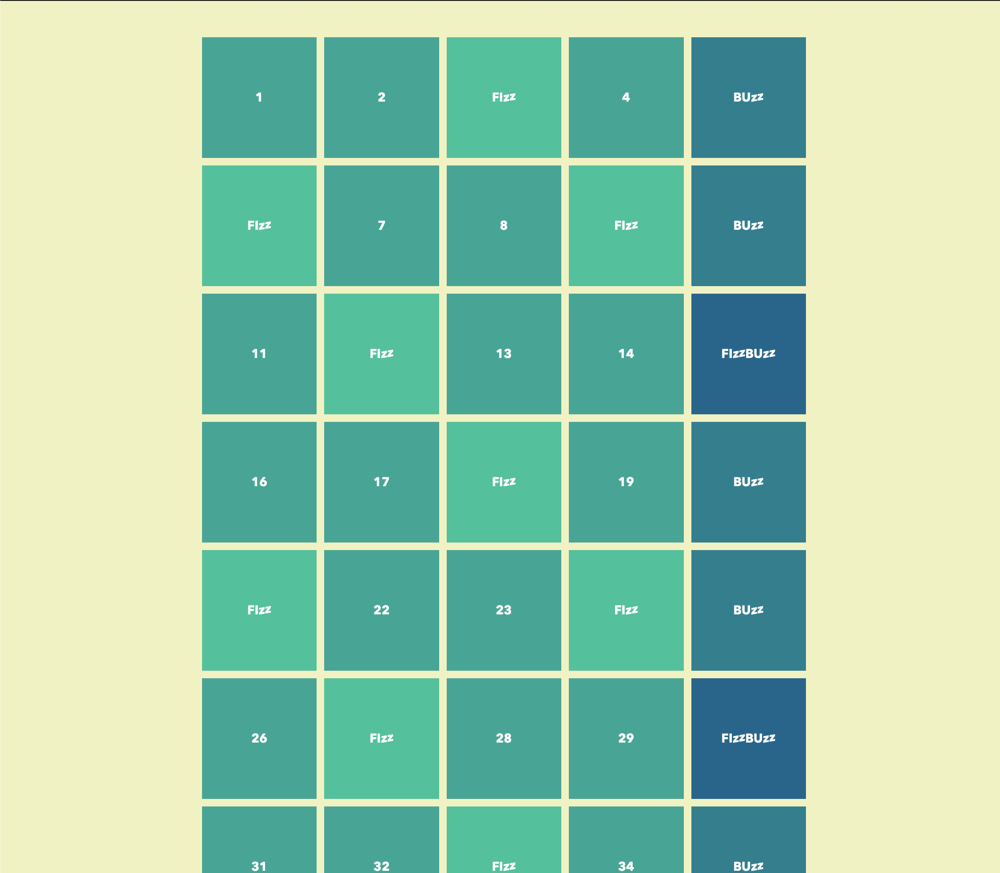

# FizzBuzz
> JS exercise given at HEPL

* * *

**js-tp-fizz-buzz** is an educational project, which will be used for `JS` courses.

**Note:** the school where the course is given, the [HEPL](http://www.provincedeliege.be/hauteecole) from Liège, Belgium, is a french-speaking school. From this point, the instruction will be in french. Sorry.

* * *

> Lors de vos cours de *web*, vous allez découvrir le langage *JavaScript* et le mettre en pratique pour apprendre à rendre vos pages web interactives.  

* * *
_FizzBuzz_ est un jeu de mots destiné aux enfants pour leur enseigner la division. Les joueurs se relaient pour compter progressivement, remplaçant tout multiple de trois par le mot _fizz_, les multiples de cinq par le mot _buzz_ et les multiples de 3 et de 5 par le mot _fizzbuzz_.

## Énoncé

Votre mission est d’afficher dans une liste ordonnée tous les nombres entre 1 et 100 avec les exceptions suivantes :

- vous affichez "Fizz" à la place du nombre si celui-ci est divisible par 3 ;
- vous affichez "Buzz" à la place du nombre si celui-ci est divisible par 5 et non par 3 ;
- vous affichez "FizzBuzz" à la place du nombre si celui-ci est divisible à la fois par 3 et par 5.


Vous pouvez commencer par une première version simplifiée en console (Voir TD).

## Aides

1. Supprimer par JavaScript la classe `no-js` de l'élément `body`, afin de faire disparaitre la boite de message pour les personnes n'ayant pas JavaScript activé sur leur navigateur.

2. Produire une liste ordonnée d’éléments allant de 1 à 100 bornes incluses;

3. Si le nombre est divisible par 3, remplacer sa valeur par la chaine de caractère `FIZZ`;

4. Si le nombre est divisible par 5, remplacer sa valeur par la chaine de caractère `BUZZ`;

5. Si le nombre est divisible par 3 et par 5, remplacer sa valeur par la chaine de caractère `FIZZBUZZ`.

6. Adapter le balisage

    1. Si ce n'est pas un multiple de 3 et/ou de 5 alors il faut produire le noeud HTML suivant

      ```html
      <li>1</li>
      ```

      `1` représente ici la valeur dynamique courante du nombre, `1`,`2`,`4`,etc.

    1. Si c'est un multiple de 3, alors il faut produire le noeud HTML suivant

      ```html
       <li class="fizz">FI<i>zz</i></li>
      ```

    1. Si c'est un multiple de 5, alors il faut produire le noeud HTML suivant  

      ```html
       <li class="buzz">BU<i>zz</i></li>
      ```

    1. Si c'est un multiple de 3 et de 5, alors il faut produire le noeud HTML suivant

      ```html
       <li class="fizzbuzz">FI<i>zz</i>BU<i>zz</i></li>
      ```

### Bonus 🥳


1. Retirez dans le fichier `index.html` la balise `ol` et produisez celle-ci par JavaScript.
2. Rendez la production des noeuds infinie. Lorsque l'utilisateur a défilé l’entièreté de la page, produisez les 10 prochains noeuds en respectant les mêmes règles.
